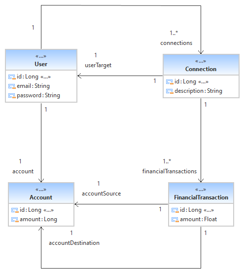
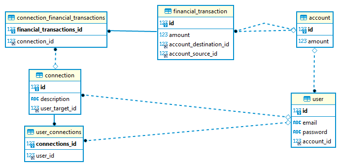

#RUN
main class :
com.paymybuddy.Application
arg :
-Djasypt.encryptor.password=clayde

#CONCEPTION
* spring boot
* spring boot jdbc
* thymeleaf
* lombok
* java 8

#UML

#MPD

#SECURE BDD ACCESS VIA JASYPT

#encrypt key howto
mvn jasypt:encrypt-value -Djasypt.encryptor.password=clayde -Djasypt.plugin.value=root
input: root (Actual password to be encrypted)
password: clayde (the secret key chosen by you)

Get the encrypted password and put it on properties like :

spring.datasource.driver-class-name=com.mysql.cj.jdbc.Driver
spring.datasource.url = jdbc:mysql://localhost:3306/paymybuddy_db
spring.datasource.username = root
spring.datasource.password = ENC(YuyT3MTGQCN4uHPilSCitBrLdcR7/zckfyDihcTtGkT1R3zVtHkeLFYV0YD0QEe9)

#run our jvm with decrypt
java -Djasypt.encryptor.password=clayde -jar spring-boot-application.jar
